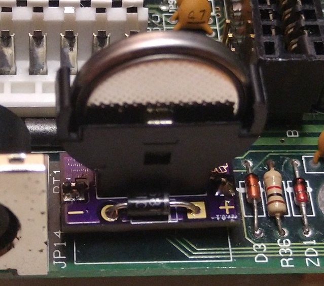
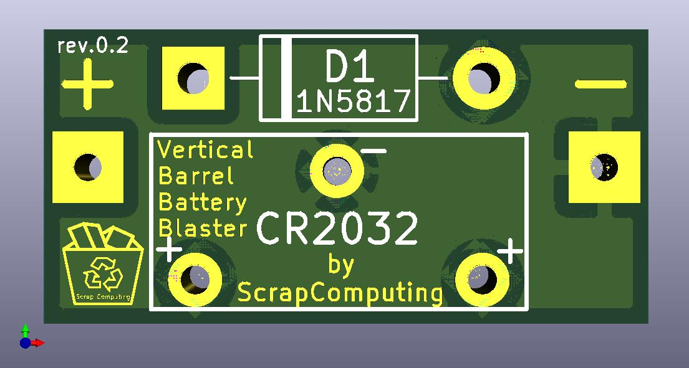
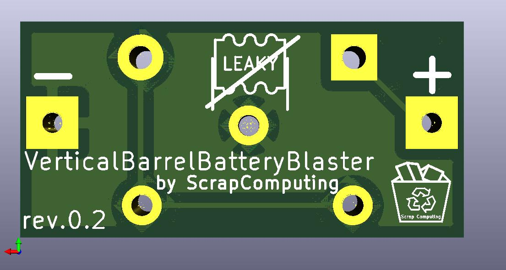

# Vertical Barrel Battery Blaster

Vertical Barrel Battery Blaster is a very small PCB for replacing old rechargeable barrel-type CMOS batteries with non-rechargeable CR2032 Lithium batteries.
This particular PCB is for the vertical type of CR2032 battery holders.

Barrel batteries were quite common on vintage computer motherboards up until the 486 era.
These barrel batteries tend to leak, damaging the motherboard and the surrounding components.

> **Warning**
> Older systems may require a higher voltage than the 3V - diode voltage drop that this board can provide. For these systems please use a board with a MAX40200 ideal diode like [Not-A-Varta](https://github.com/wiretap-retro/Not-A-Varta-CR2032) or [Horizontal Barrel Battery Blaster](https://github.com/scrapcomputing/HorizontalBarrelBatteryBlaster) rev.0.2+.

# Similar Projects
- [Not-A-Varta](https://github.com/wiretap-retro/Not-A-Varta-CR2032) Uses a MAX40200 ideal diode
- [Horizontal Barrel Battery Blaster](https://github.com/scrapcomputing/HorizontalBarrelBatteryBlaster) Works with several types of diodes, including a MAX40200.
- [Barrel Battery Blaster](https://github.com/scrapcomputing/BarrelBatteryBlaster)

# Video
https://www.youtube.com/watch?v=O76bEk7QzwA

# How can I get one?

You can order one at your PCB fab of choice.
The simplest way is to use the zipped gerber files from the [releases](https://github.com/scrapcomputing/VerticalBarrelBatteryBlaster/releases).

# Bill of materials

Item                                           | #   | Description
-----------------------------------------------|-----|-----------------------------------------
Male header pins out of a 2.54mm pitch header  | 2   | For connecting the VerticalBarrelBatteryBlaster to the motherboard
Vertically mounted 3-lead CR2032 battery holder| 1   | For the CR2032 Lithium battery
Diode (preferably schottky, like 1N5817)       | 1   | To prevent the Lithium battery from being charged by the motherboard

